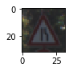
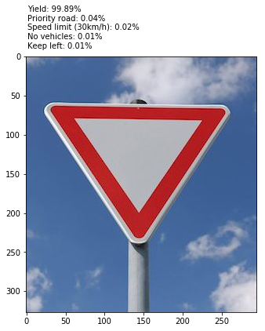

# Self-Driving Car Engineer Nanodegree

## Deep Learning

## Project: Build a Traffic Sign Recognition Classifier

####Writeup / README

**1. Provide a Writeup / README that includes all the rubric points and how you addressed each one. You can submit your writeup as markdown or pdf. You can use this template as a guide for writing the report. The submission includes the project code.**

You're reading it! and here is a link to my [project code](https://github.com/florianvandamme/CarND-Traffic-Sign-Classifier-Project)

####Data Set Summary & Exploration

**1. Provide a basic summary of the data set. In the code, the analysis should be done using python, numpy and/or pandas methods rather than hardcoding results manually.**

I used Numpy and Python to explore the dataset. I got the following results.

```
Number of training examples = 34799
Number of testing examples = 12630
Number of validation examples = 4410
Traffic sign image data shape = (32, 32, 3)
Number of classes = 43
```

**2. Include an exploratory visualization of the dataset.**

I've pulled up a random image from the training set with it's corresponding label.


```
24 = Road narrows on the right
```

####Design and Test a Model Architecture

**1. Describe how you preprocessed the image data. What techniques were chosen and why did you choose these techniques? Consider including images showing the output of each preprocessing technique. Pre-processing refers to techniques such as converting to grayscale, normalization, etc. (OPTIONAL: As described in the "Stand Out Suggestions" part of the rubric, if you generated additional data for training, describe why you decided to generate additional data, how you generated the data, and provide example images of the additional data. Then describe the characteristics of the augmented training set like number of images in the set, number of images for each class, etc.)**

To start out I normalized all the images using the following method
```python
def normalize(batch):
    x_min = batch.min(axis=(1, 2), keepdims=True)
    x_max = batch.max(axis=(1, 2), keepdims=True)

    return (batch - x_min)/(x_max-x_min)
```

This returns a normalized 32, 32, 3 image. To augment the data, I decided to flip, skew and zoom the pictures and adding these to the training set. Effectively quadrupling the dataset.

**2. Describe what your final model architecture looks like including model type, layers, layer sizes, connectivity, etc.) Consider including a diagram and/or table describing the final model.**

| **Layer**          | **Input**      |
| :-------------:|:-------------:|
| Input     | 32x32x3 RGB image |
| Convolution 1     | 1x1 stride, valid padding, outputs 28x28x6      |
| RELU | Activation |
| Dropout | 0.7 keep probability |
| Max pooling | 2x2 stride, outputs 14x14x6 |
| Convolution 2 | 1x1 stride, valid padding, outputs 10x10x16 |
| RELU | Activation |
| Dropout | 0.7 keep probability |
| Max pooling | 2x2 stride, outputs 5x5x16 |
| Flatten | Outputs 400 |
| Fully connected layer 1 | Input 400, output 200 |
| RELU | Activation |
| Dropout | 0.5 keep probability |
| Fully connected layer 2 | Input 200, output 100 |
| RELU | Activation |
| Dropout | 0.5 keep probability |
| Fully connected layer 3 | Input 100, output 84 |
| RELU | Activation |
| Dropout | 0.5 keep probability |
| Fully connected layer 4 | Input 84, output 43 |
| RELU | Activation |
| Dropout | 0.5 keep probability |
| Softmax | Output |

**3. Describe how you trained your model. The discussion can include the type of optimizer, the batch size, number of epochs and any hyperparameters such as learning rate.**

To train my model I used following hyper-parameters:
```python
EPOCHS = 40
BATCH_SIZE = 128
LEARNING_RATE = 0.0005
DROPOUT = 0.5
CONV_DROPOUT = 0.7
```

As optimizer I used the `AdamOptimizer`.

**4. Describe the approach taken for finding a solution and getting the validation set accuracy to be at least 0.93. Include in the discussion the results on the training, validation and test sets and where in the code these were calculated. Your approach may have been an iterative process, in which case, outline the steps you took to get to the final solution and why you chose those steps. Perhaps your solution involved an already well known implementation or architecture. In this case, discuss why you think the architecture is suitable for the current problem.**

My final model results were:

* training set accuracy of `95.6%`
* validation set accuracy of `93.8%`
* test set accuracy of `66.67%` (New images)

I've based my model on [this published model](http://yann.lecun.com/exdb/publis/pdf/sermanet-ijcnn-11.pdf). From there I did some tweaks to the input data. Because I was getting really good training results but bad validation results (overfitting). I've applied dropout which had a performance increase from 5 to even 10% accuracy in validation.

####Test a Model on New Images
**1. Choose five German traffic signs found on the web and provide them in the report. For each image, discuss what quality or qualities might be difficult to classify.**

In the random test I was having trouble with pictures that contained "extra" information e.g. the road, trees,.. so I played around with zooming out the training images which seemed to have positive results. But this can still be improved.

I obtained the following results

```
Total accuracy on new images: 66.67%
```




---

The model still has difficulty with 'noise' in the image. Trees and roads are setting it off by quite a bit. However if I recrop the images to only contain the traffic sign without the noise, the model correctly classifies each image.

**3. Describe how certain the model is when predicting on each of the five new images by looking at the softmax probabilities for each prediction. Provide the top 5 softmax probabilities for each image along with the sign type of each probability. (OPTIONAL: as described in the "Stand Out Suggestions" part of the rubric, visualizations can also be provided such as bar charts)**

As seen in the images above, I the model 'knows' what the images contains the probability rates are very high (>96%). Howerver if the model is confused by noise it's predictions are super low.
